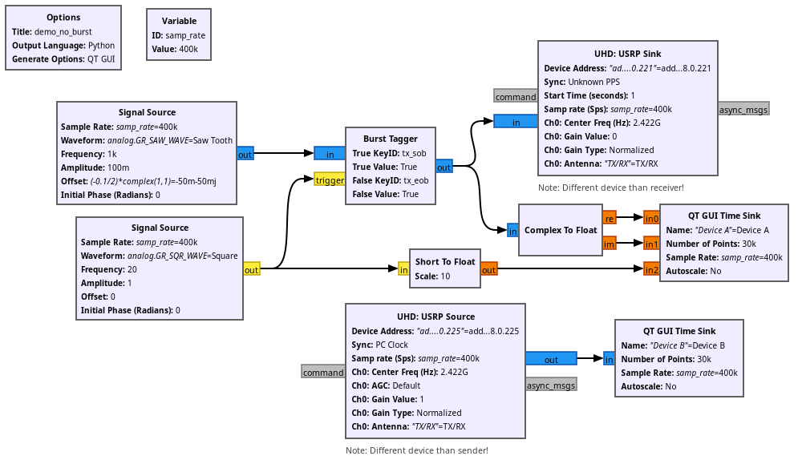
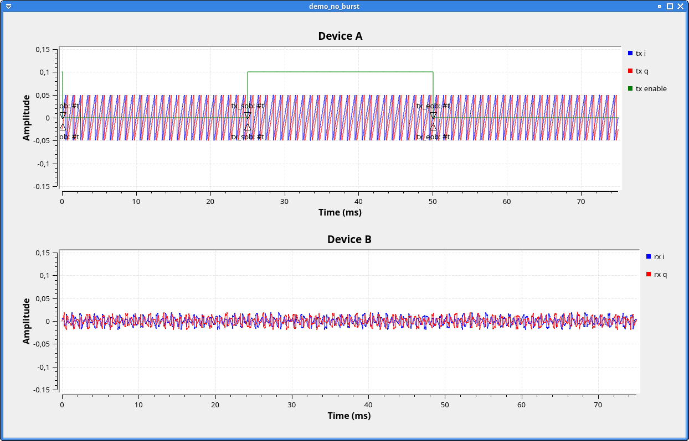

# demo\_no\_burst

I can't seem to get the bursty transmissions to work with the USRP Sink block.

This "repository" is a dump of related files, to easily provide/track a minimal-ish example of a setup that tries (and fails) to transmit in bursts. Here's what the flow graph looks like:

Steps to reproduce:
- Run `gnuradio-companion demo_no_burst.grc`
- Connect two X310 devices:
- Click "Execute the flow graph"

Expected behavior:
1. The transmitted signal (top graph) is a sawtooth signal that is switched on and off, with GUI markers for the tx_sob and tx_eob tags.
2. The receiver (bottom graph) sees the signal from the transmitter only intermittently, the timing corresponding to the tx_sob and tx_eob tags, just like [the documentation](https://wiki.gnuradio.org/index.php/USRP_Sink#Bursty_Transmission) explains.

Actual behavior: The transmitted signal seems fine, but the receiver sees a continuous signal, nearly as if the USRP Sink block completely ignores my tags:

What could I be doing wrong?

## What I already tried

- I tested various spelling variants of the tag keys/values.
- I already updated the USRP firmware image and rebooted all devices.
- I think I'm using mostly the newest software, so it's not a known issue: GnuRadio 3.10.9.2 (Python 3.11.8), UHD_4.6.0.0+ds1-5+b2
- Ettus X310 rev 13, Daughterboard UBX-160 v2

## Also of note

I already checked the source code of the [USRP Sink block](https://github.com/gnuradio/gnuradio/blob/main/gr-uhd/lib/usrp_sink_impl.cc#L459), but I don't fully grasp how it works or why "my" tags get ignored.

The [`tags_demo` example program](https://github.com/gnuradio/gnuradio/blob/main/gr-uhd/examples/c%2B%2B/tags_demo.cc#L71) from the GnuRadio source tree runs without any errors and transmits a continuous signal into the air, but no "timed bursts", contrary to its own description text.
However, the program hasn't been updated in several years, so perhaps it doesn't work for unrelated reasons.
